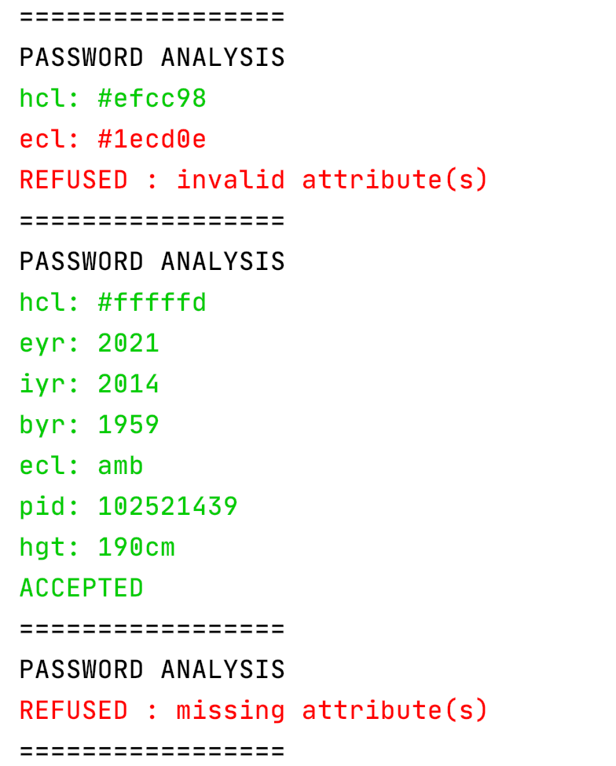

# Thoughts on the day

Easy one but a bit longer

## Thoughts on learning/using Rust

* Getting more familiar with Rust
* Used some new language features :
    * Closures
    * match
    * using a external crate (colour)
* The code I ended up with is a bit verbose because I wanted to add some pretty printing :



# Pseudo code

```rustlang

For each line in input
    parse line and collect attributes in an array

    if we meet an empty line // means we reach the end of a passport
        
        reduce the required nb of attribute if passport contains 'cid'
        if attributes count is correct
            if all attributes are compliant
                increase valid_passport_counter    
            
return valid_passport_counter  
```

Idea on optimization :
 - Not printing anything (duh :D )
 
 
